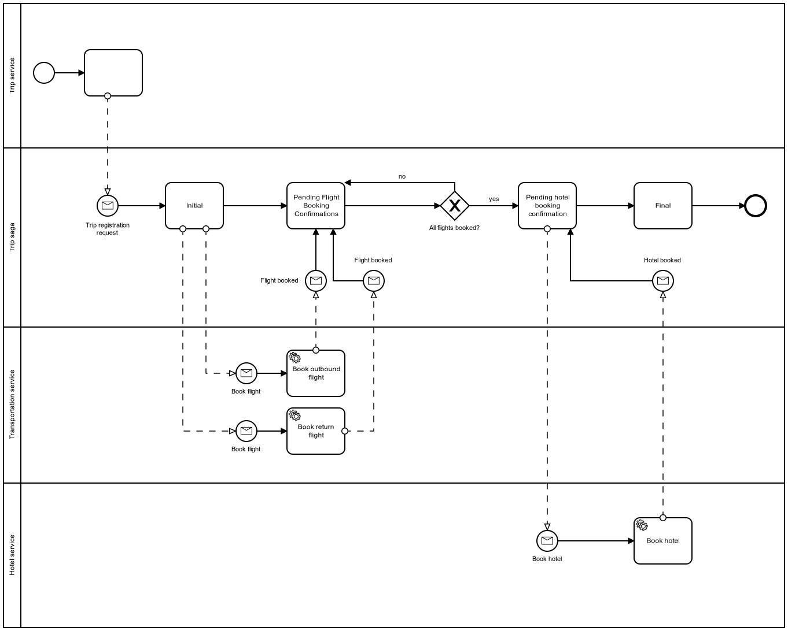

# Masstransit Saga Demo

## Description

This repo contains a sample application that demonstrates how to make a saga in MassTransit.

### Saga process flow



## Building and running the code

First export the dev cert so we can include it in the Docker containers in order to serve HTTPS on localhost

```cmd
dotnet dev-certs https -ep %USERPROFILE%\.aspnet\https\aspnetapp.pfx -p Passw0rd
dotnet dev-certs https --trust
```

You can read more about certificates in docker containers in the [docs](https://docs.microsoft.com/en-us/aspnet/core/security/docker-https?view=aspnetcore-6.0#running-pre-built-container-images-with-https)

Next build the demo images and run them in docker-compose.

```cmd
docker-compose build
docker-compose up -d
```

Now we book a trip at [https://localhost:5005/swagger/index.html](https://localhost:5005/swagger/index.html)
